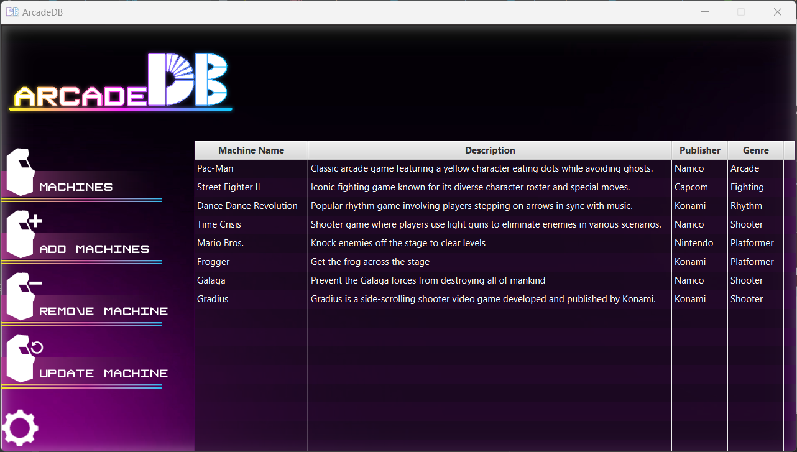

    

---
ArcadeDB is the ultimate database for arcade management. Keep track of your arcade's cabinets in a simple, easy to use interface with a unique, retro-inspired design.

## Features
- View all of your arcade's machines in a simple, easy to use interface
- Add new machines to your arcade
- Edit existing machines
- Delete machines

## Installation

### Dependencies
- IntelliJ IDEA
- Java Runtime Environment

### Setup
1. Clone the repository
2. Open the project in IntelliJ IDEA
3. Open the `src/main/java/com.example.arcadedb/Main.java` file
4. Click the green play button in the top right corner of the editor
5. The program will start

## How to Use

### Startup
1. Run the program
2. Enter the database name, database host, username, and password
3. Click the login button
4. Wait for the database to load
5. If login is successful, you will be taken to the main database screen

### Adding a Machine
1. Click the "Add Machine" button
2. Enter the machine's name, description, publisher, and genre
3. Click the "Add Machine" button
4. The machine will be added to the database

### Removing a Machine
1. Click the machine you want to remove
2. Click the "Remove Machine" button
3. A confirmation dialog will appear, click "Yes" to confirm
4. The machine will be removed from the database

### Updating a Machine
1. Click the machine you want to update
2. Click the "Update Machine" button
3. A dialog will appear with the machine's current information
4. Update the machine's information
5. Click the "Update Machine" button
6. The machine will be updated in the database

## Credits
- Art and Graphics: Cole Dennie
- Frontend Development: Cole Dennie
- Backend Development: Colton Thibert